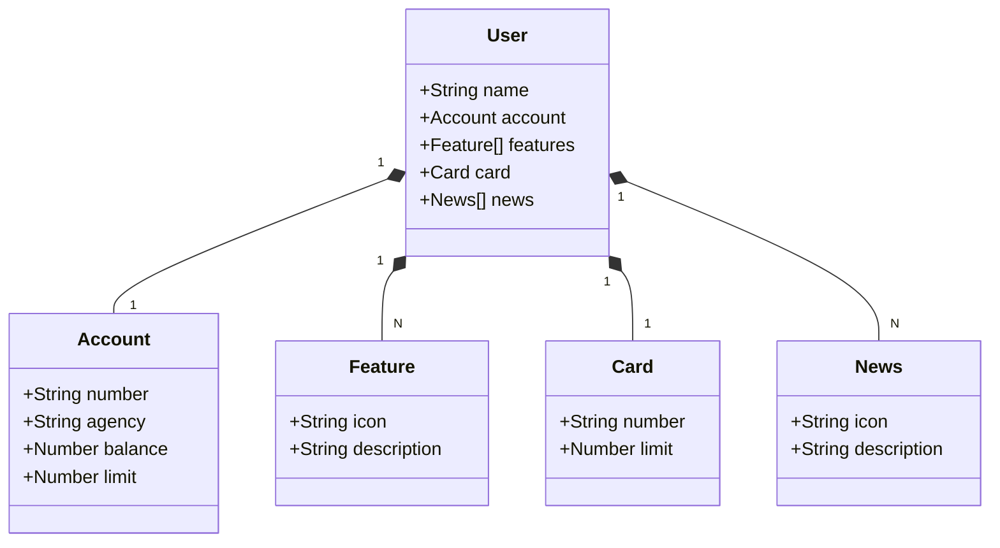

# Santander Dev Week 2023
Projeto desenvolvido como parte da Santander Dev Week 2023, promovida pela DIO. Nesta jornada, tive a oportunidade de colocar em prática conceitos modernos do ecossistema Java, construindo uma API RESTful completa.

## Diagrama de Classes

## Observações Finais
Este projeto foi reproduzido com fins educacionais, acompanhando o conteúdo da DIO.
